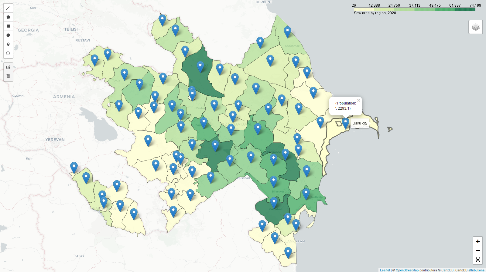

# leafMap

The folium package of Python build geospatial map in a Jupyter environment.

GitHub repo: https://github.com/bextla20/Maps

PyPI - Page: https://pypi.org/project/leafmap

**leafmap** is a Python package for geospatial analysis and interactive mapping in a Jupyter environment. Folium builds on the data wrangling strengths of the Python ecosystem and the mapping strengths of the leaflet.js library. Manipulate your data in Python, then visualize it in on a Leaflet map via folium.

Concepts
folium makes it easy to visualize data that’s been manipulated in Python on an interactive leaflet map. It enables both the binding of data to a map for choropleth visualizations as well as passing rich vector/raster/HTML visualizations as markers on the map.

The library has a number of built-in tilesets from OpenStreetMap, Mapbox, and Stamen, and supports custom tilesets with Mapbox or Cloudmade API keys. Folium supports different types of geospatial data and l have used shp data.

Aim of this project to show sow area and population of each region. For this l have used shp data and population information from excel. After load both of this data merge and used over one data.
In this project, l have used two most tool (Choropleth maps and marker) of folium. Choropleth can be easily created by binding the data between Pandas DataFrames/Series and Geo/TopoJSON geometries. Color Brewer sequential color schemes are built-in to the library, and can be passed to quickly visualize different combinations.

Marker type view of population for each region and Choropleth map visulaize area of each region.

